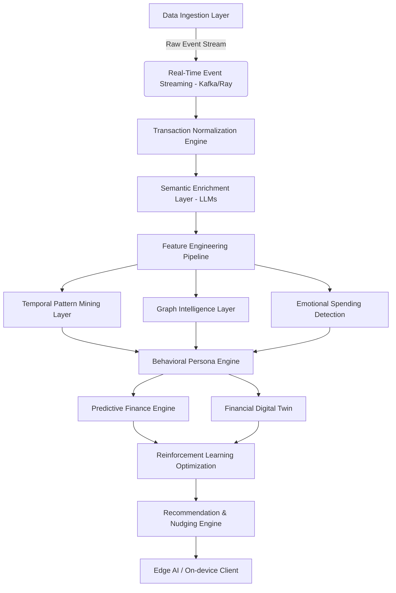

# AI Financial Persona Engine — Advanced System Design

*A Next-Generation Cognitive Financial Intelligence & Behavioral Analytics Platform*

---

## 1. Executive Summary

The **AI Financial Persona Engine** is a research-grade, autonomous AI CFO system designed to move beyond traditional ledger-based budgeting. By leveraging deep learning, temporal mining, and psychometric inference, the system functions simultaneously as a computational psychologist, a behavioral economist, and a predictive financial analyst. 

It predicts consumption collapses before they happen, nudges users away from emotional spending, and constructs a highly personalized "Financial Digital Twin" for every user.

---

## 2. Enterprise System Architecture

The architecture relies on a highly scalable, real-time distributed microservices infrastructure. 



### 2.1 Data Ingestion Layer
Ingests multi-modal financial footprints asynchronously.
*   **Open Banking / PSD2 APIs:** Webhooks and polling for live transaction states.
*   **POS & Receipt OCR:** Vision-transformers for extracting unstructured receipt semantics.
*   **SMS Transaction Logs:** Parsing legacy banking notifications using regex + lightweight NLP.

### 2.2 Transaction Normalization & Semantic Enrichment Layer
Raw strings (e.g., `POS*STARB COFFEE 0921`) are mathematically ambiguous.
*   **LLM-based Semantic Reasoning:** A local or API-driven LLM (e.g., Gemini 1.5 Pro) with strict JSON-schema enforcement translates messy strings into deterministic structures.
    ```json
    {
      "merchant": "Starbucks",
      "category": "Caffeine/Indulgence",
      "is_subscription": false,
      "implied_emotion": "Routine/Dopamine"
    }
    ```
*   **Retrieval Augmented Generation (RAG):** Cross-references merchant IDs against an internal vector database (Pinecone/Milvus) of global vendors.

### 2.3 Feature Engineering Pipeline
Constructs high-dimensional vectors for every user:
*   Velocity of spend (Rolling 3/7/30 days)
*   Weekend vs. Weekday ratio
*   Midnight consumption index
*   Payday decay coefficient

---

## 3. Advanced ML & Behavioral Analytics

### 3.1 Temporal Analytics & Sequence Mining
Capturing *when* and in *what order* a user spends is more valuable than *what* they spend.
*   **Temporal Convolution Networks (TCNs) & LSTMs:** Used to forecast end-of-month financial collapse based on current trajectory.
*   **PrefixSpan & SPADE Algorithms:** Discovers sequential rules. (e.g., *If user pays rent -> buys groceries -> 80% chance they order fast-food the next night due to cognitive depletion.*)
*   **Payday Dopamine Spikes:** Detected via **Isolation Forests** measuring the deviation of spending volume within 48 hours of salary ingestion against the user's standard baseline.

### 3.2 Graph Intelligence Layer (GNN)
The financial ecosystem is modeled as a massive heterogeneous graph in **Neo4j**.
Nodes: `User`, `Merchant`, `Category`, `Time`, `Emotion`.
Edges: `PURCHASED_AT`, `TRIGGERS`, `FOLLOWED_BY`.
*   **Graph Neural Networks (GNNs):** Generate embeddings that capture "Spending Influence Networks." If the user clusters closely with a demographic that goes bankrupt, the system triggers early interventions.
*   **Trigger Propagation:** Identifies that `Stressful Work Event (Location Tracking)` -> `Bar/Alcohol Spend` -> `Late-night E-Commerce Spend`.

### 3.3 Behavioral Persona Engine (Psychometric Inference)
Uses **Latent State Modeling (Hidden Markov Models - HMM)** and **Gaussian Mixture Models (GMM)** to cluster users into latent psychological states:
1.  *State A: Discipline (Low velocity, high savings)*
2.  *State B: Dopamine Seeking (High velocity, micro-transactions, night spending)*
3.  *State C: Financial Burnout (Subscription overload, late payment fees)*

### 3.4 Financial Digital Twin & Predictive Finance
A simulated sandbox of the user's financial future.
*   **Monte Carlo Simulations:** Simulates 10,000 potential financial futures based on the user's transition matrices (Markov Chains).
*   **Survival Analysis (Kaplan-Meier Estimator):** Calculates the `Survival Runway Score`—the exact probability distribution of hitting $0 balance before the next payday.

---

## 4. Proprietary Scoring Systems

These indices formulate the core of the Behavioral Engine.

### 4.1 Dopamine Spending Index (DSI)
Quantifies impulsive, reward-seeking consumption.
`DSI = (NightSpends * w1) + (FastFood * w2) + (MicroTxns * w3) / TotalTxnVolume`
*If DSI > 0.7, the AI intervenes to freeze non-essential digital wallets.*

### 4.2 Financial Stability Score (FSS)
A real-time measure of economic resilience, updating via **Bayesian Networks** as new data arrives.

### 4.3 Cognitive Discipline Index (CDI)
Measures the adherence to the user's declared "wishlist" vs. actual impulsive deviation.

---

## 5. Autonomous AI CFO & Nudging (Reinforcement Learning)

The system doesn't just observe; it acts.
*   **Reinforcement Learning Optimization (RL):** The Nudging Engine uses Multi-Armed Bandits to find the exact time, channel, and tone to send a notification.
    *   *Reward function:* User avoids an impulsive purchase within 12 hours.
    *   *Penalty:* User ignores the push notification or completes the purchase.
*   **Emotional Spending Detection:** One-Class SVM detects anomalies that correlate with stress (e.g., spending 3x the usual amount at a cosmetics store after 9 PM). The AI agent intervenes: *"I noticed an unusual spike in comfort spending. Would you like to lock your card for 12 hours?"*

---

## 6. Security, Privacy & Edge AI

*   **Zero-Trust & Federated Learning:** Behavioral embeddings are trained on-device. Only model weight updates are sent to the central server, ensuring absolute privacy.
*   **Differential Privacy:** Noise is injected into the training dataset to ensure individual transaction histories cannot be reconstructed by adversarial attacks.
*   **PSD2 / GDPR Compliance:** Strict consent-driven ephemeral storage for raw transaction data. Data is immediately transformed into vector embeddings and the raw PII is purged.

---

## 7. Recommended Production Tech Stack

| Layer | Technology | Justification |
| :--- | :--- | :--- |
| **Mobile Client / UI** | Flutter | Cross-platform, high-performance Glassmorphism UI rendering |
| **Backend API / Orchestration** | FastAPI (Python) | High-concurrency asynchronous ML inference serving |
| **Event Streaming** | Apache Kafka | Real-time transaction event ingestion and pub/sub |
| **Stream Processing / Distributed ML**| Ray | Scaling Reinforcement Learning and parallel hyperparameter tuning |
| **Graph Database** | Neo4j | Mapping hidden behavioral relationships and transaction flows |
| **Vector Database** | Pinecone / Milvus | Storing merchant embeddings and LLM semantic vectors |
| **Analytical DW (OLAP)** | ClickHouse / DuckDB | Lightning-fast time-series aggregation for dashboarding |
| **Deep Learning Framework** | PyTorch | Temporal Convolution Networks, GNNs, and Autoencoders |
| **LLM Orchestration** | LangChain / LlamaIndex | Agentic workflows and RAG for transaction parsing |
| **Infrastructure** | Kubernetes (EKS/GKE) | Auto-scaling ML pods based on inference load |

---

*This document outlines a blueprint for a startup-grade, visionary Fintech product that transcends traditional bookkeeping, entering the realm of proactive, cognitive wealth preservation.*
